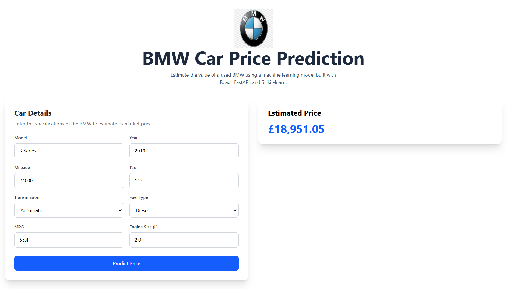
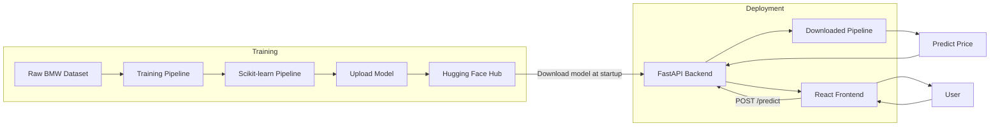
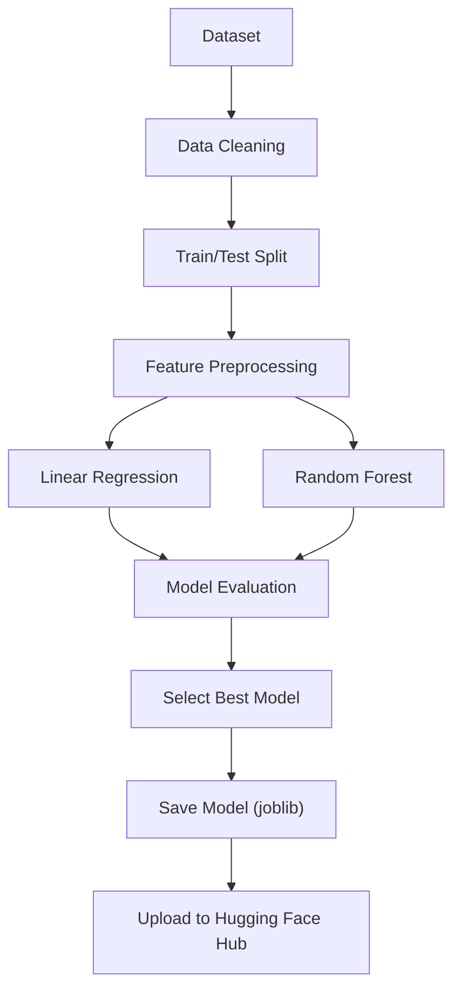

# BMW Car Price Predictor

<p>


</p>

</div>

A full-stack machine learning application that predicts the market price of used BMW cars based on their specifications. The project combines a Scikit-learn regression model with a FastAPI backend and a React frontend to provide real-time price predictions through a simple web interface.

**Live Demo:** https://bmw-car-price-predictor.vercel.app

---

## Overview

This project estimates the selling price of a used BMW using features such as the model, year, mileage, transmission, fuel type, tax, MPG, and engine size.

The application is built with a production-oriented workflow, including data preprocessing, model training, API development, and frontend deployment. The trained model is hosted on Hugging Face Hub and is downloaded automatically when the API starts.

---
## Screenshot

<p align="center">
  
</p>


---
## Features

- Predict used BMW prices in real time
- Machine learning pipeline built with Scikit-learn
- Automatic preprocessing using `Pipeline` and `ColumnTransformer`
- FastAPI REST API with Pydantic validation
- Responsive React interface built with Tailwind CSS
- Model hosted on Hugging Face Hub
- Separate frontend and backend deployments

---

## Tech Stack

| Layer | Technologies |
|--------|--------------|
| Frontend | React, Vite, Tailwind CSS |
| Backend | FastAPI, Pydantic, Uvicorn |
| Machine Learning | Scikit-learn, Pandas, NumPy |
| Model Storage | Hugging Face Hub |
| Deployment | Vercel, FastAPI Cloud |

---

## Project Architecture



---

## Model Training Workflow



---

## Project Structure

```text
BMW-Car-Price-Predictor/
│
├── backend/
│   ├── app/
│   ├── requirements.txt
│   └── pyproject.toml
│
├── frontend/
│   ├── src/
│   ├── package.json
│   └── vite.config.js
│
├── src/
│   ├── model/
│   └── pipeline/
│   └── data/
│
├── notebook/
├── data/
│   ├── raw/
│   └── preprocessed/
|
├── main.py
└── README.md
```

---

## API

### GET /

Returns a welcome message.

```json
{
  "message": "Welcome to the Car Price Prediction API!"
}
```

### POST /predict

Predicts the price of a used BMW.

Example request:

```json
{
  "model": "3 Series",
  "year": 2019,
  "mileage": 24000,
  "transmission": "Automatic",
  "fuelType": "Diesel",
  "tax": 145,
  "mpg": 55.4,
  "engineSize": 2.0
}
```

Example response:

```json
{
  "price": 21450.75
}
```

---

## Getting Started

### Clone the repository

```bash
git clone https://github.com/alibro005/BMW-Car-Price-Predictor.git

cd BMW-Car-Price-Predictor
```

### Backend

```bash
cd backend

pip install -r requirements.txt

fastapi dev app/app.py
```

The API will be available at:

```
http://localhost:8000
```

Interactive API documentation:

```
http://localhost:8000/docs
```

### Frontend

```bash
cd frontend

npm install

npm run dev
```

Open:

```
http://localhost:5173
```

### Train the model

```bash
pip install -r requirements.txt

python main.py
```

---

## Deployment

| Component | Platform |
|-----------|----------|
| Frontend | Vercel |
| Backend | FastAPI Cloud |
| Model | Hugging Face Hub |

---

## Future Improvements

- Support additional car brands
- Add automated testing
- Set up CI/CD with GitHub Actions
- Display confidence intervals for predictions

---

## License

This project is licensed under the [MIT License](LICENSE).

---

## Author

**Muhammad Ali Siddiqui**

LinkedIn: https://linkedin.com/in/alibro005


